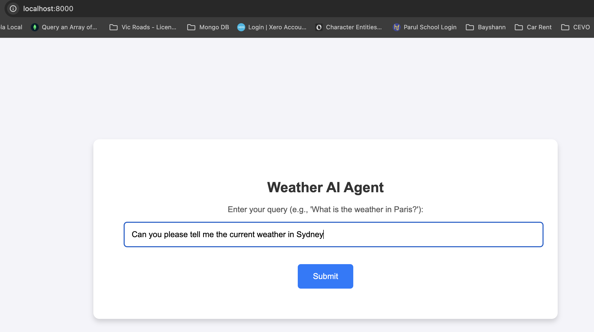
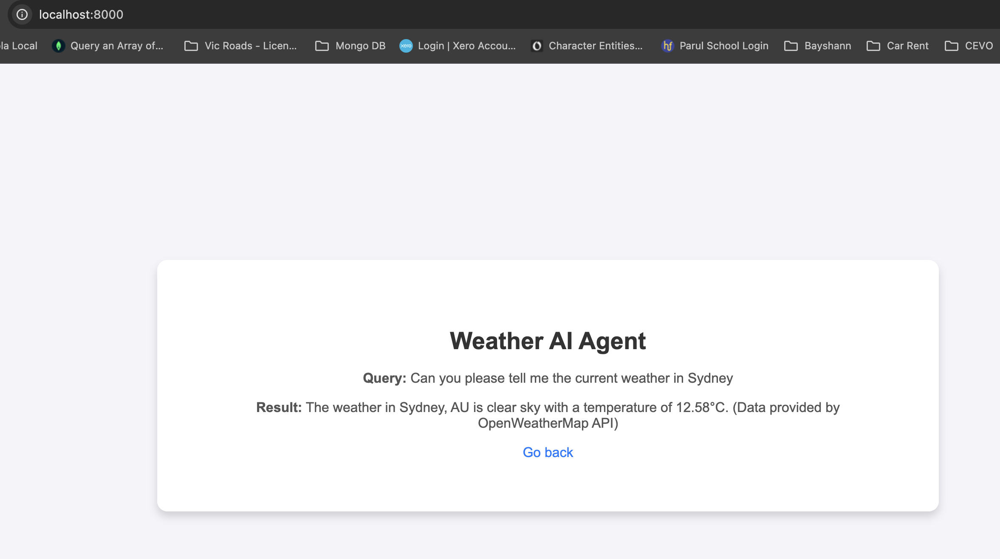

# Weather AI Assistant

This project is a sophisticated AI Assistant that provides weather information, calculates distances between cities, and answers general knowledge queries. It uses OpenWeatherMap API for weather data and AWS Bedrock for AI-based query processing.

## Features
- Fetches weather information for cities worldwide
- Calculates distances and travel information between cities
- Provides comprehensive general knowledge responses
- Supports natural language queries
- Simple web-based UI

## Query Types and Capabilities

### 1. Weather Queries
- Real-time weather conditions
- Temperature in Celsius
- Weather descriptions
- Country information
Example: "What's the weather like in Paris?"

### 2. Distance Queries
- Road distance between cities
- Estimated driving time
- Main route information
Example: "What's the distance between Melbourne and Sydney?"

### 3. General Knowledge
- Answers to factual questions
- Clear and direct responses
Example: "How many days are in a year?"

## Prerequisites
- Python 3.13 or higher
- An OpenWeatherMap API key
- AWS credentials with access to Bedrock

## Environment Variables
Create a `.env` file in the root directory with:
```env
WEATHER_API_KEY=<your_openweathermap_api_key>
AWS_REGION=<your_aws_region>
AWS_ACCESS_KEY_ID=<your_aws_access_key_id>
AWS_SECRET_ACCESS_KEY=<your_aws_secret_access_key>
AWS_SESSION_TOKEN=<your_aws_session_token>
```

## Setup
1. Clone the repository:
   ```bash
   git clone <repository-url>
   cd weather-agent
   ```

2. Create a virtual environment and activate it:
   ```bash
   python3 -m venv venv
   source venv/bin/activate
   ```

3. Install the required dependencies:
   ```bash
   pip install -r requirements.txt
   ```

## Running the Application
1. Start the server:
   ```bash
   python3 weather_ui.py
   ```

2. Open your browser and navigate to `http://localhost:8000`

## File Structure
- `weather_model.py`: Contains the AI model logic, weather API integration, and query processing
- `weather_ui.py`: Handles the web interface and HTTP server
- `requirements.txt`: Lists Python dependencies
- `.env`: Contains environment variables (not included in repository)

## Screenshots



## Future Enhancements
- Support for more detailed weather forecasts
- Additional travel-related information
- Integration with more data sources
- Enhanced natural language processing capabilities

## License
This project is completely generated by GitHub Copilot.
